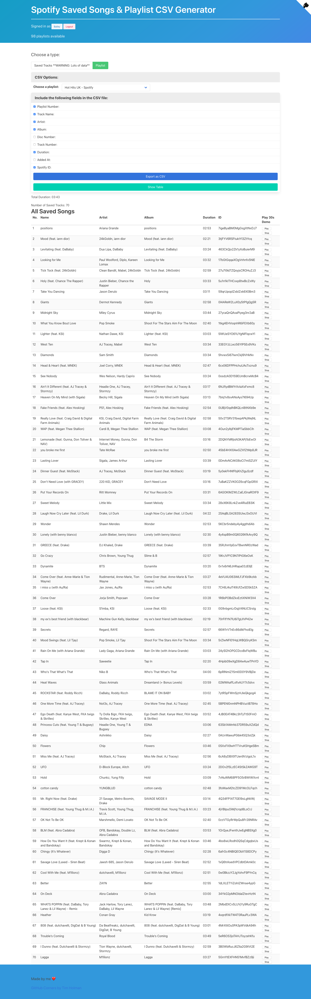
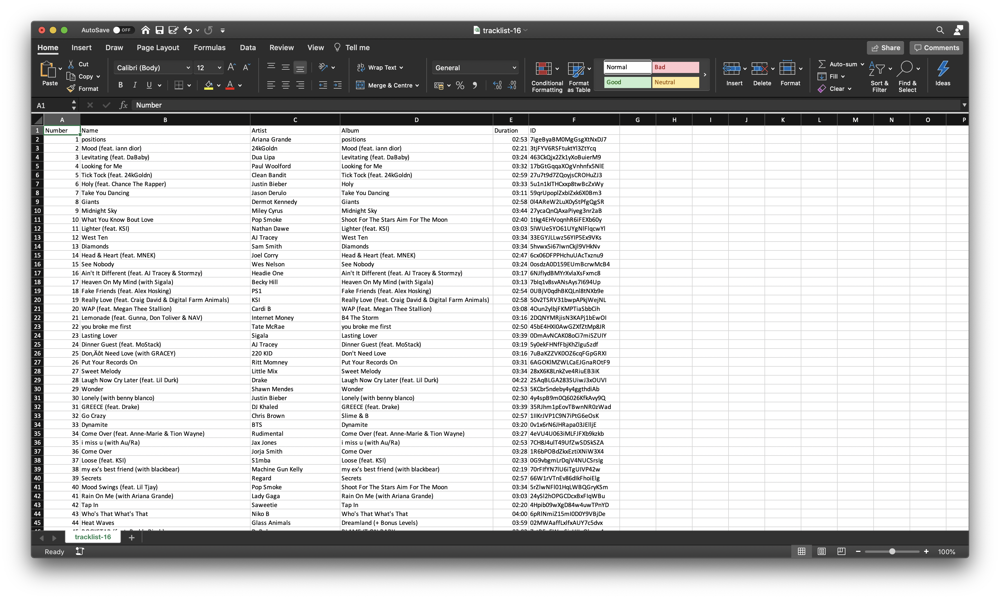

# Node-Spotify-Saved-Songs-CSV-Exporter

A node webapp which allows you to download a CSV file with information about a selection of tracks.

## Features:

- Can generate a CSV file which includes information about each track within your saved songs or in a specific playlist.

- Can choose which columns are included in the CSV file with an automatically updating table.

- Securely uses [Spotify's OAuth2 API](https://developer.spotify.com/documentation/web-api/).

- Play a 30s demo of each track from the website.

# Screenshots:

## Web View:

	

## Generated CSV file:

	

## Install:

1. Clone the repo:
   `git clone https://github.com/Bailey-1/Node-Spotify-Saved-Songs-CSV-Exporter.git && cd Node-Spotify-Saved-Songs-CSV-Exporter`

2. Install NPM packages:
   `npm i`

3. Create and register a new spotify application at:
   `https://developer.spotify.com/dashboard/applications`

4. Rename `TEMPLATE.env` to `.env` and configure it with the `CLIENT_ID`, `CLIENT_SECRET`, and `CALLBACK_URL` from the spotify app.

5. Start the server: `node server.js` and go to the web page: `http://localhost:8888`

# Credit:

- Bulma CSS Framework: https://github.com/jgthms/bulma https://bulma.io/

- Github Corners: https://github.com/tholman/github-corners https://tholman.com/github-corners/
